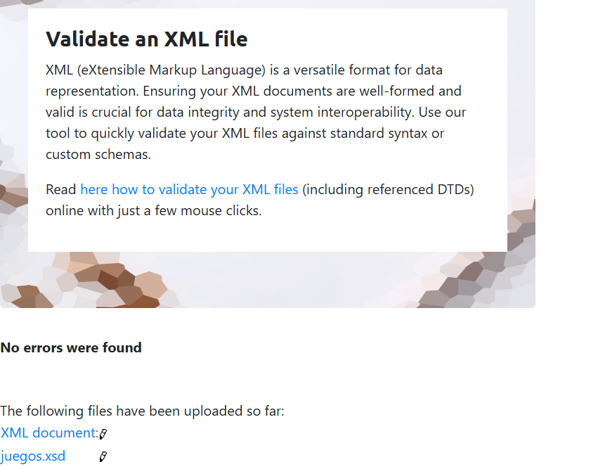

# WikiZelda

## Descripción del proyecto

**WikiZelda** es una aplicación web tipo enciclopedia interactiva basada en el universo de *The Legend of Zelda*. Permite buscar personajes y monstruos mediante la API externa de Zelda, ver detalles individuales, guardar favoritos y consultar un catálogo de juegos cargado desde un archivo XML.

La aplicación está dividida en varias páginas:

* **Inicio** → búsqueda dinámica con API + favoritos locales
* **Detalle** → información completa de cada entidad
* **Favoritos** → gestión de elementos guardados
* **Catálogo** → lectura de juegos desde XML

El objetivo es practicar:

* consumo de APIs REST
* manipulación del DOM
* almacenamiento en cliente
* transformación de datos (XML/JSON)
* validación con esquemas

---

## Tecnologías y herramientas

* **HTML5 / CSS3** → estructura y diseño
* **JavaScript (Vanilla)** → lógica principal
* **Fetch API** → consumo de datos externos
* **localStorage** → almacenamiento local
* **XML + DOMParser** → lectura de catálogo de juegos
* **JSON Schema / XSD** → validación de estructuras de datos

### Alternativas consideradas

* React → descartado por requerimientos del proyecto (JS puro)
* Firebase / Firestore → inicialmente planteado, pero no implementado por su complejidad. Se ha intentado realizar pero no he sido capaz de terminar de incorporarlo, por lo que finalmente se utiliza localstorage.

---

## Zelda API

Se utiliza la API pública:

👉 [https://zelda.fanapis.com/api](https://zelda.fanapis.com/api)

### Endpoints usados

#### Búsqueda general

```
GET /characters?name={nombre}
GET /monsters?name={nombre}
```

Devuelve listas de resultados filtrados por nombre.

#### Detalles

```
GET /characters/{id}
GET /monsters/{id}
```

Devuelve información completa de un elemento.

---

### Ejemplo de respuesta real

```json
{
  "data": [
    {
      "id": "1",
      "name": "Link",
      "description": "Hero of Hyrule...",
      "gender": "Male",
      "race": "Hylian"
    }
  ]
}
```

### Campos utilizados

* `id` → identificar elementos
* `name` → título principal
* `description` → descripción corta
* `gender` / `race` → datos extra en personajes

---

## Formatos de datos

### JSON

Formato usado por la API. Es ligero, fácil de leer y perfecto para intercambio de datos en aplicaciones web.

Usado en:

* API de Zelda
* favoritos en localStorage

---

### XML

Formato estructurado en árbol. Más verboso pero muy útil para datos jerárquicos.

Usado en:

* catálogo de juegos (`juegos.xml`)

---

### CSV

Formato tabular separado por comas. Ideal para hojas de cálculo o exportación de datos.

(No implementado)

---

### Diferencias clave

* JSON → ideal para APIs modernas
* XML → estructuras complejas y jerárquicas
* CSV → datos simples tipo tabla

---

## Esquemas de validación

### JSON Schema

Valida la estructura de las entidades de la API:

* `id` obligatorio
* `name` obligatorio
* `description` opcional

Garantiza que los datos usados en la app sean consistentes antes de mostrarlos.

---

### XSD (XML Schema)

Se ha comprobado que la validación fuese correcta en la página https://www.xmlvalidation.com/index.php?id=1&L=0
Pruebas:

Valida el archivo `juegos.xml`:

* cada `juego` debe tener:

    * título
    * desarrolladora
    * publicadora
    * plataforma
    * año
    * puntuación
* atributo `id` obligatorio

Garantiza que el catálogo de juegos esté bien formado.

---

## Almacenamiento

### localStorage (usado)

Se utiliza para:

* caché de búsquedas
* favoritos

#### Ventajas:

* rápido
* sencillo
* no requiere servidor
* persistente en el navegador

#### Ejemplo:

```js
localStorage.setItem("favoritos", JSON.stringify([...]));
```

---

### Limitaciones de localStorage

* solo datos en el navegador
* no sincronización entre dispositivos
* capacidad limitada
* no seguro para datos sensibles

Por eso no es ideal para sistemas complejos o multiusuario.

---

### Firebase (NO implementado)

Inicialmente se planteó usar Firestore, pero no se llegó a implementar.

Google Firebase permite:

* almacenamiento en la nube
* sincronización en tiempo real
* usuarios y autenticación
* reglas de seguridad avanzadas

#### Reglas de seguridad (en producción)

Permiten controlar:

* quién puede leer/escribir
* validación de datos
* acceso por usuario

Ejemplo conceptual:

```js
allow read, write: if request.auth != null;
```

---

### Alternativas de almacenamiento

* **localStorage** → datos simples y locales (usado aquí)
* **sessionStorage** → datos temporales
* **IndexedDB** → grandes volúmenes de datos
* **Firestore** → apps escalables en la nube

---

## Decisiones técnicas

### 1. Uso de localStorage en lugar de backend

Se eligió para simplificar el proyecto y evitar dependencias externas.

---

### 2. Separación de módulos JS

El código se divide en:

* `ui.js` → DOM, api y lógica visual
* `transform.js` → XML y transformación

Mejora mantenimiento y organización.

Soy conocedora de que lo óptimo habría sido el hacer un api.js pero comencé a realizar todo el proyecto en ui.js y no me dio tiempo de cambiarlo, ya que cada vez que trataba de hacerlo me saltaba algún error por consola.

---

## Instrucciones de uso

1. Clona o descarga el proyecto
2. Abre `index.html` en un navegador
3. Navega entre:

    * Inicio
    * Favoritos
    * Catálogo

### Importante

* No requiere instalación de dependencias
* No requiere servidor backend
* Funciona 100% en frontend
* No se puede acceder de forma directa a Detalles (a menos que sea desde el html) ya que se debe acceder clicando alguna de las tarjetas al hacer una búsqueda.

---

### Aclaraciones:
Aunque no ha sido totalmente implementada, he dejado en el proyecto un archivo .js llamado `firebase.js` donde se encuentra mi intento por realizar dicha parte del proyecto, aunque se encuentra inconcluso.

El apartado de CSV finalmente no fue implementado ya que no comprendía si finalmente debía realizarse o no, ya que varias veces en clase se comentó que podría ser modificado dicho apartado.
